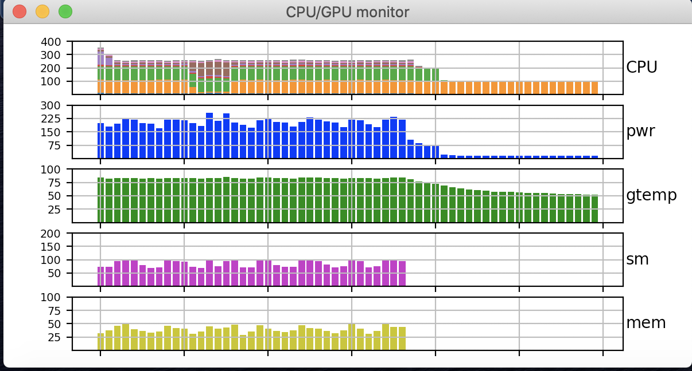

# Historymonitor

A graphical history is useful when remotely monitoring gpus and cpus, in order to see whether they are working or have finished/crashed.  In addition, I needed to do this over a reverse tunnel to my mac with an addition ssh to my linux machine.  This is a simple python script that accomplishes this and can be easily adapted for any unix monitor command.

The script monitors the cpu with sar and produces a stacked plots showing the activation of the 8 processors with different colors.  This allows you to see when the processors have changed even when the total load is the same.

It also can monitor gpus using nvidia-smi and produces separate plots for power, temperature, sm usage, and memory.

- To install sar:
  - sudo apt-get install sysstat
- To install nvidia-smi:
  - sudo apt install nvidia-440       # or the appropriate driver for your system

