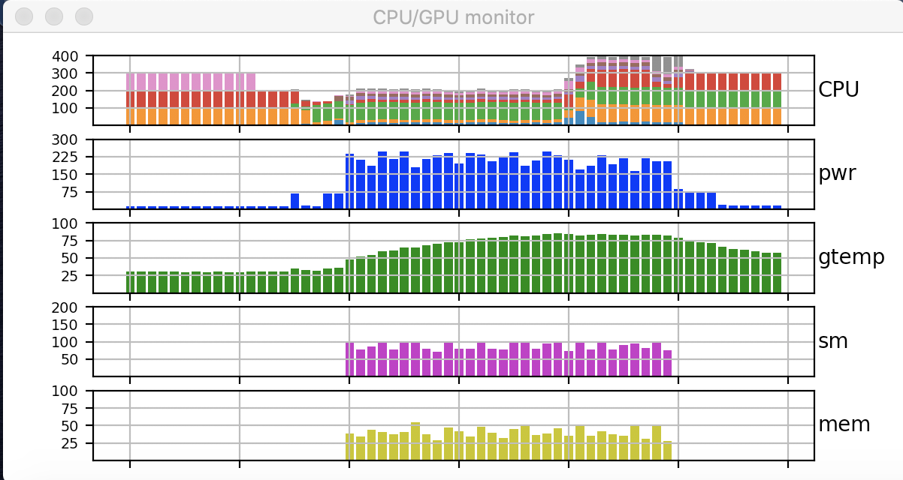

# History monitor

A graphical history is useful when remotely monitoring gpus and cpus, in order to see whether they are working or have finished/crashed.  This is a simple python script that work over tunnels and can be easily adapted for any unix monitor command.



The script monitors the cpu with sar and produces a stacked plots showing the activation of the 8 processors with different colors.  This allows you to see when the processors have changed even when the total load is the same.

It also can monitor gpus using nvidia-smi and produces separate plots for power, temperature, sm usage, and memory.

- To install sar:
  - sudo apt-get install sysstat
- To install nvidia-smi:
  - sudo apt install nvidia-440       # or the appropriate driver for your system

- To run: 
    python historymonitor.py
- To run in background, type the same command and when the graph starts, then press control-z.

- To change the programs that provide input for the monitor, just change the subprocess commands.
```python
    sarproc = subprocess.Popen(["sar","-P ALL -u "+str(interval)],
                           shell=True,stdout=subprocess.PIPE,
                           stderr=subprocess.PIPE)
```
- For example, to run sar on a remote linux machine from a remote machine over a tunnel from a local machine, replace the above code with this code.
```python
    # the remote command contacts a remote linux machine from another remote machine and run sar to get the cpu activity
    remotecmd = "ssh user@remotelinuxmachine -f sar -P ALL -u "+str(interval)
    # the remote mac is contacted from my home machine through a tunnel over PORT
    sarproc = subprocess.Popen(["ssh","-p PORT","user@localhost",remotecmd],
                           shell=False,stdout=subprocess.PIPE,
                           stderr=subprocess.PIPE)
```

